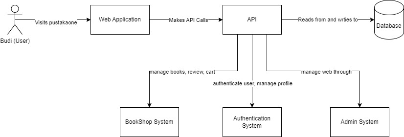
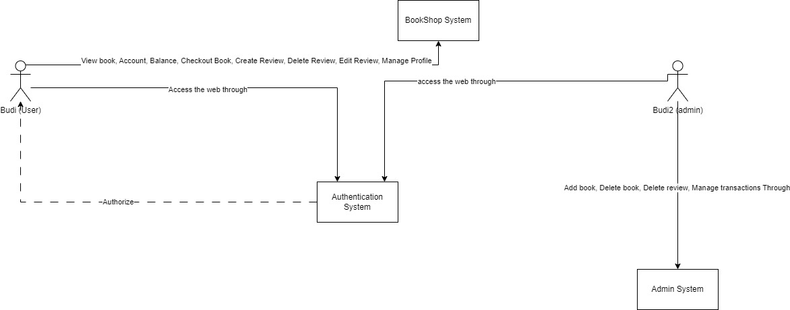
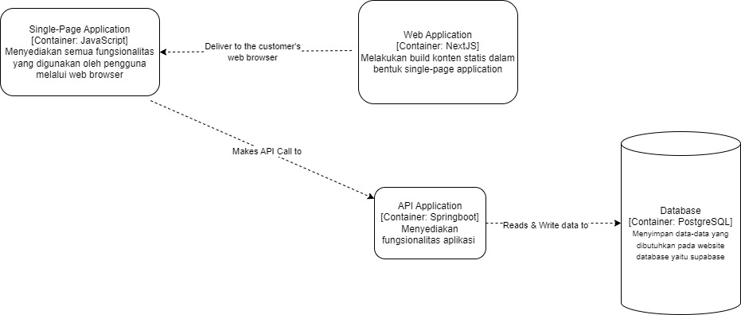
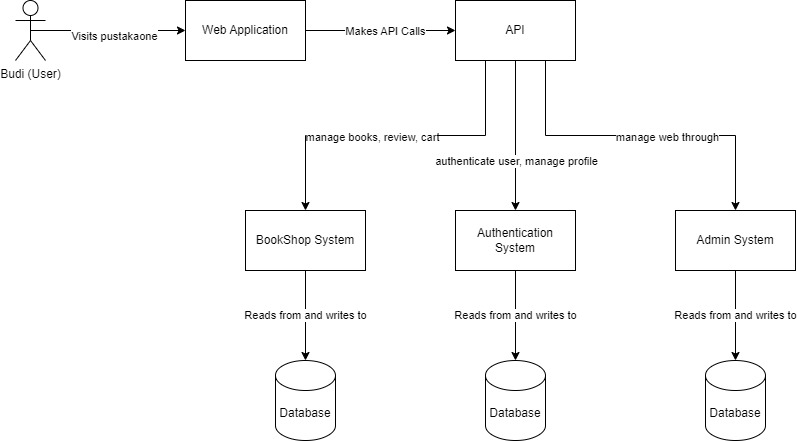
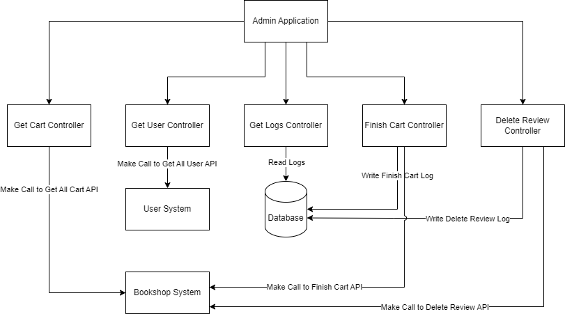
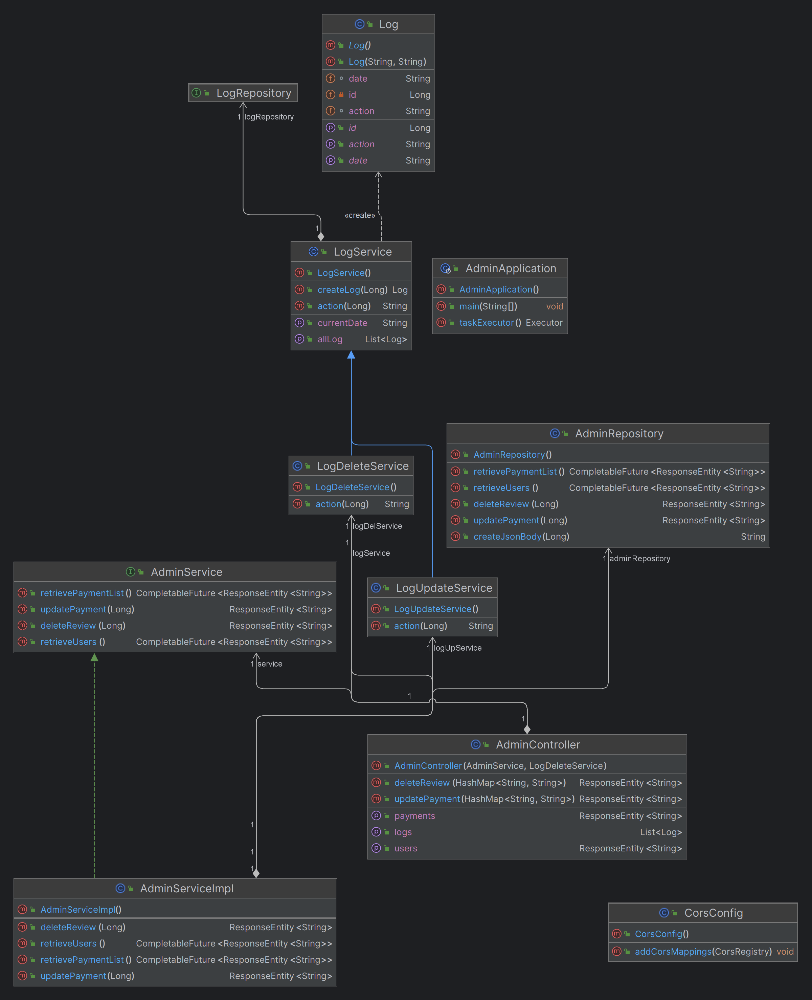

# advprog-module12
Module 12 Advanced Programming 2023/2024

## Deliverable G.1

### Container Diagram

### Context Diagram

### Deployment Diagram

## Deliverable G.2

## Deliverable G.3
### Risk Analysis untuk Arsitektur yang Diperbarui

### a. Risiko Skalabilitas
1. **Identifikasi**
   - Setiap komponen memiliki basis data sendiri yang dapat menjadi bottleneck saat jumlah pengguna meningkat.
2. **Konsensus**
   - Risiko skalabilitas tinggi karena peningkatan jumlah pengguna dapat memperlambat kinerja sistem.
3. **Mitigasi**
   - Implementasi pemisahan database.

### b. Risiko Keamanan
1. **Identifikasi**
   - Data sensitif tersebar di berbagai basis data yang memerlukan pengamanan yang ketat.
2. **Konsensus**
   - Penyebaran data sensitif meningkatkan risiko kebocoran data.
3. **Mitigasi**
   - Implementasi enkripsi data, otentikasi dua faktor, dan audit keamanan secara berkala.

## Deliverable Individual
**Fitur Admin**  
Container Diagram  

Code Diagram  

